Review of books from the dataset   Goodreads-books 

Here are the instruction if anyone need to understand the flow of this reprosetory 

There in the repo you will find PLOTS_R which means all plottings in Rstudio using R code and lybraries.
plots_python is similarly all plootings of data in Jupytor Notebook using Python lybraries 
Mahendra_nandi_P   and Mahendra_nandi_R   here P means pyhton and R means Rstudio 
so .ipynb files are created Jupytor Ntebook
and .R files are created in Rstudio
You will find the books.csv file which is the required file for data and other 3  .csv files are of no use here though . 
The final reports are the .pdf and .pptx files . So you will eventually get every thing inside it.

- **NOTE**: I have perhaps changed the books.csv file mannually a little bit so the modified file naming booksP.csv will be uploaded here too. And I have collected the data from kuggle. [HERE YOU can find IT](https://www.kaggle.com/jealousleopard/goodreadsbooks)

## Some Visuals:
# 
- [x] Here average rating is shown for diferent languages used in the book.1
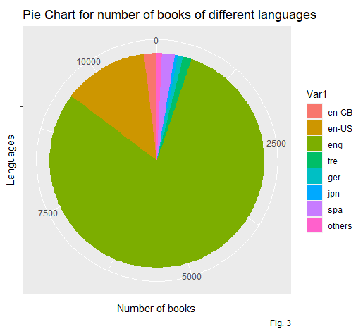
- [x] Here average rating is shown for diferent languages used in the book.2

- [x] Here average rating is shown for diferent languages used in the book.3
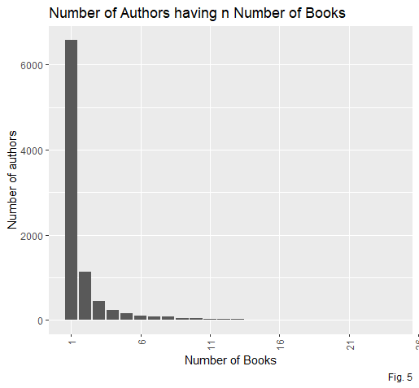
- [x] Here average rating is shown for diferent languages used in the book.4
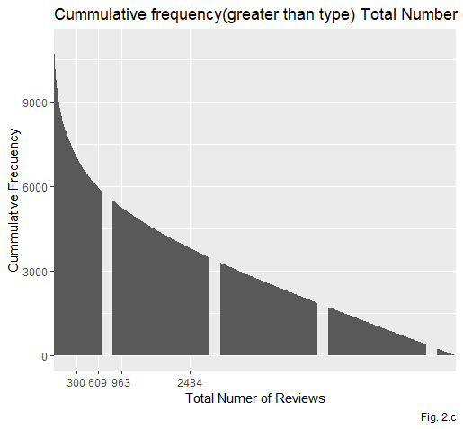
- [x] Here average rating is shown for diferent languages used in the book.5
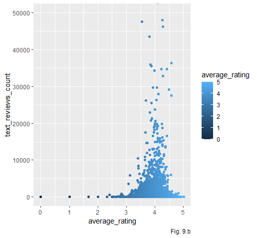

# 
- [x] Here average rating is shown for diferent languages used in the book.1
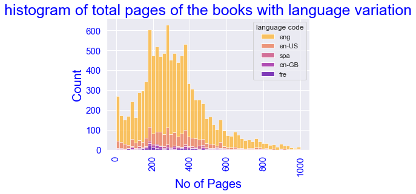

- [x] Here average rating is shown for diferent languages used in the book.2
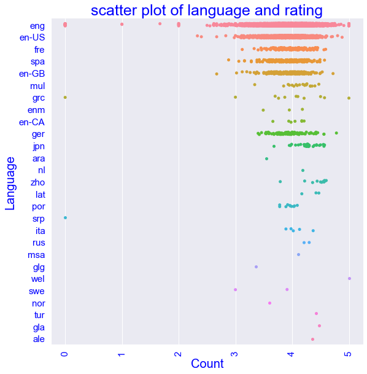
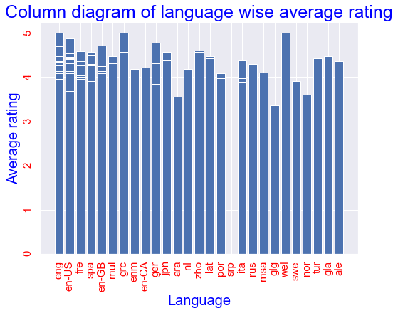

- [x] Here average rating is shown for diferent languages used in the book.3
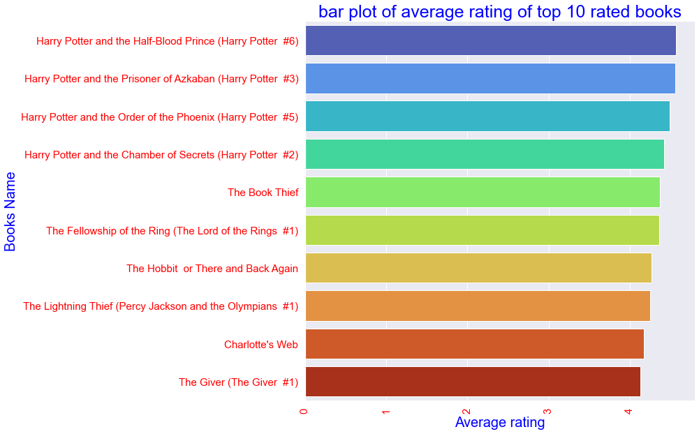

- [x] Here average rating is shown for diferent languages used in the book.4
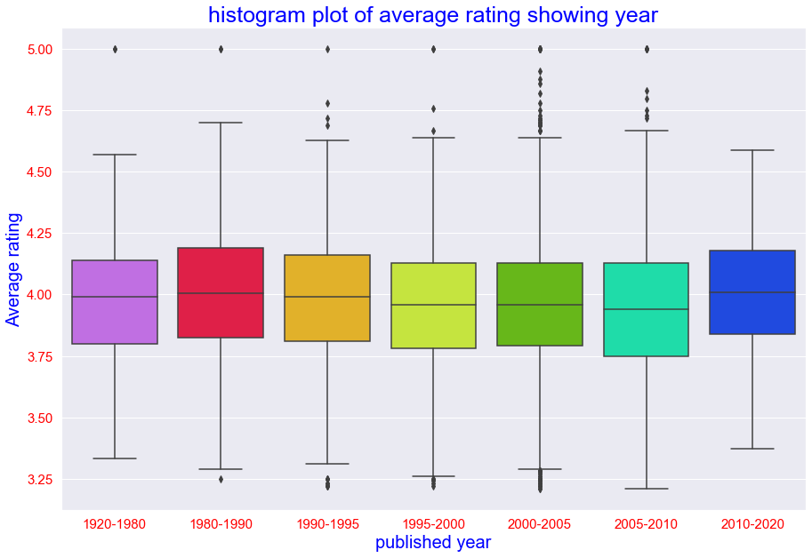

- [x] Here average rating is shown for diferent languages used in the book.5
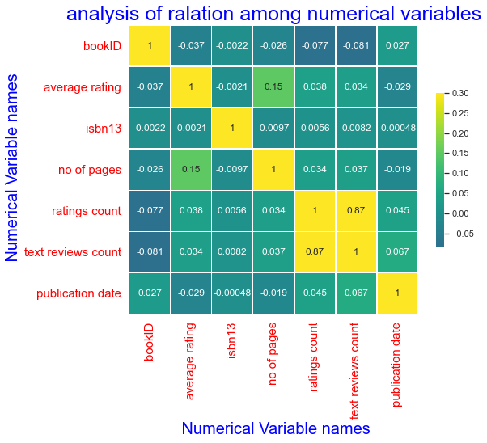

- [x] Here average rating is shown for diferent languages used in the book.6
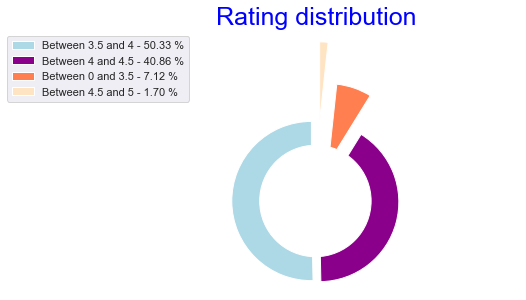

- [x] Here average rating is shown for diferent languages used in the book.7
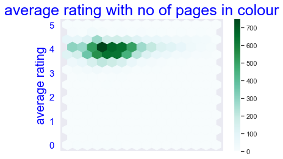

- [x] Here average rating is shown for diferent languages used in the book.8
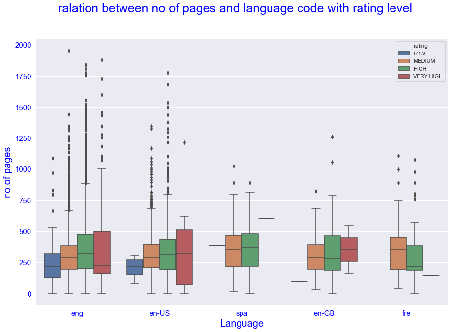

- [x] Here average rating is shown for diferent languages used in the book.9
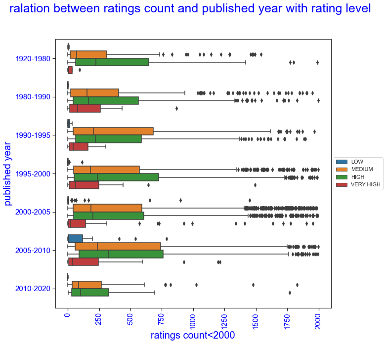

- [x] Here average rating is shown for diferent languages used in the book.0
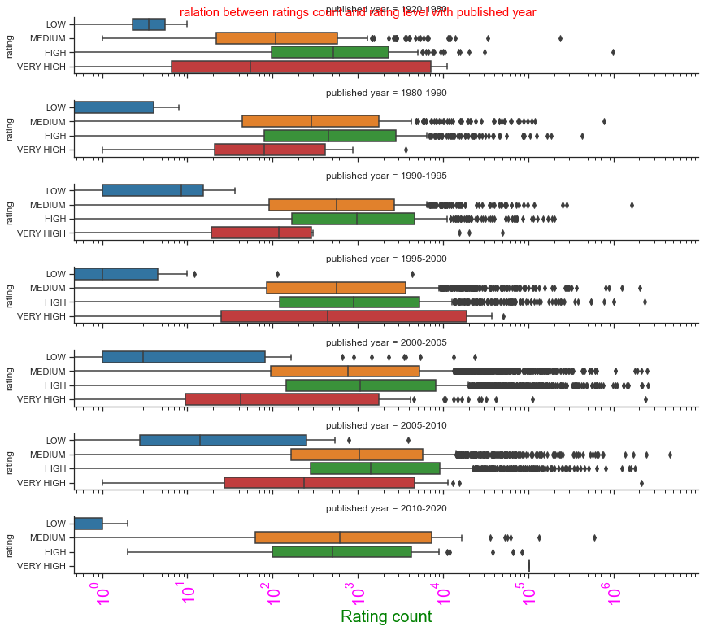

- [x] Here average rating is shown for diferent languages used in the book.11
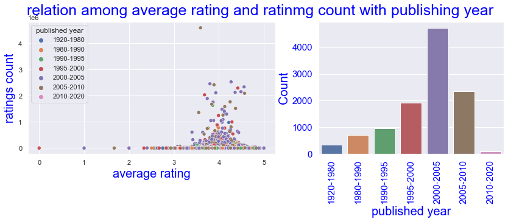

- [x] Here average rating is shown for diferent languages used in the book.22
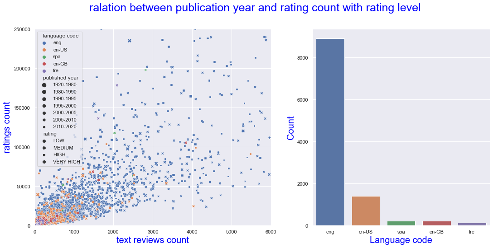

- [x] Here average rating is shown for diferent languages used in the book.33
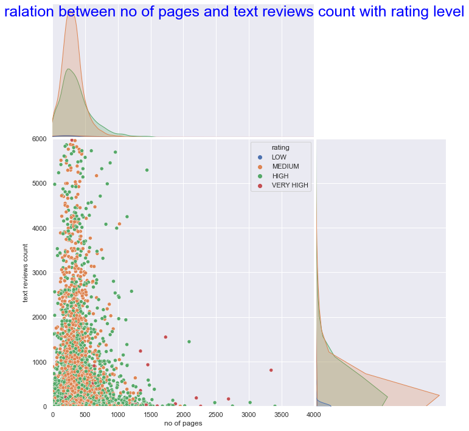

- [x] Here average rating is shown for diferent languages used in the book.44
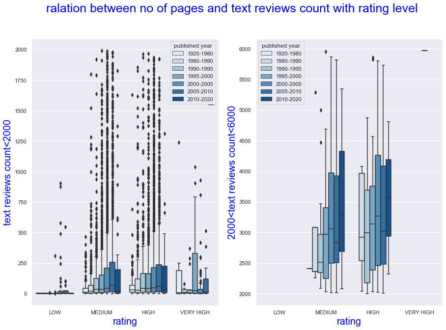

- [x] Here average rating is shown for diferent languages used in the book.55
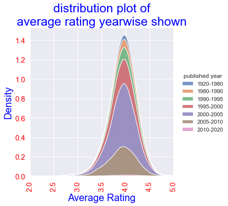

- [x] Here average rating is shown for diferent languages used in the book.66
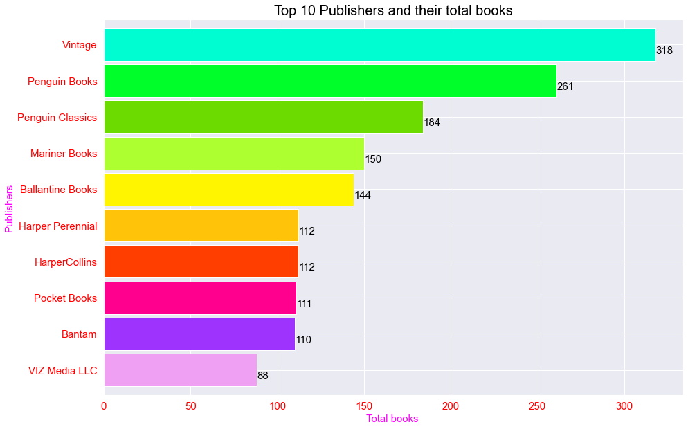

- [x] Here average rating is shown for diferent languages used in the book.77
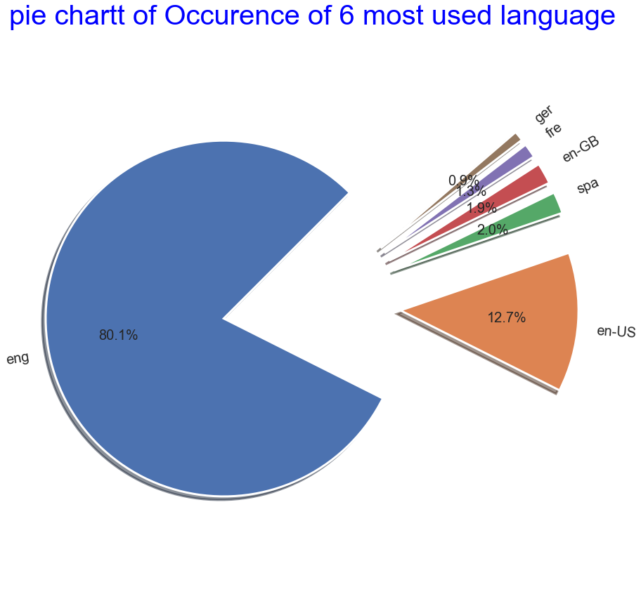

The further task is to build a prediction model which will make the work colplete.
Thank You .
If you have any querry about anything please feel free to contact 
and also for any suggestion..

here is my email ID :   mahendranandi.rkma@gmail.com
My LimkedIn profile : [Mahendra Nandi](https://www.linkedin.com/in/mahendra-nandi-7038b8176/)
