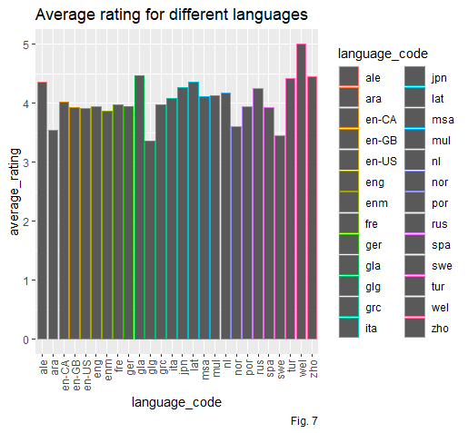

Review of books from the dataset   Goodreads-books 

Here are the instruction if anyone need to understand the flow of this reprosetory 

There in the repo you will find PLOTS_R which means all plottings in Rstudio using R code and lybraries.
plots_python is similarly all plootings of data in Jupytor Notebook using Python lybraries 
Mahendra_nandi_P   and Mahendra_nandi_R   here P means pyhton and R means Rstudio 
so .ipynb files are created Jupytor Ntebook
and .R files are created in Rstudio
You will find the books.csv file which is the required file for data and other 3  .csv files are of no use here though . 
The final reports are the .pdf and .pptx files . So you will eventually get every thing inside it.

- **NOTE**: I have perhaps changed the books.csv file mannually a little bit so the modified file naming booksP.csv will be uploaded here too. And I have collected the data from kuggle. [HERE YOU can find IT](https://www.kaggle.com/jealousleopard/goodreadsbooks)

# About the dataset:
# 

We have the following features or culumns with us after modification:
**bookID:** 11127 distinct values
**title:** 10352 distinct values
**authors:** 6643 distinct values
**average rating:** 209 distinct values
**isbn:** 11127 distinct values
**isbn13:** 23 distinct values
**language code:** 27 distinct values
**no of pages:** 997 distinct values
**ratings count:** 5294 distinct values
**text reviews count:** 1822 distinct values
**publication date:** 87 distinct values
**publisher:** 2292 distinct values
**rating:** 4 distinct values
Here is the description,

## Detailed explaination and some inferences from the analysis:

> - **(1) Distribution of average rating:**
From the distribution of the
average rating it is
clear that almost all the books
have been rated in the range 3.5-
4.5 . Out of almost 11000
books 22 books is rated as ‘’5’’.

> - **(2)Dependencies
between
different review
parameters and
average ratings:**
We can see that maximum books
got reviews less than 20000 

> - **(3) . Number of books in different languages:**
Here maximum books are written in “eng”
language . 80% book is written in “eng”
13% in “en-US” and the remaining 7% is in
other language.

> - **(4) Number of books in different
page ranges:**
Pages of maximum books(around 60%) are in
the range of 200-400
> - **(5) Number of authors having
exact number of books:**
There are more than 6000 authors who
wrote only one book . And 1000 authors
wrote two books . The number of authors
who wrote more than 5 books is very low.
> - **(6) Books published in a different
years:** It is seen that in every year no of published
books is increased largely . But after 2016 it
suddenly goes down.

> - **(7)Dependency between Average
rating and different languages:**
Though the number of books written in “eng”
is much greater than other languages , average
rating of books written in 'eng' is ~3.9
. Whereas very few books are written
in “wel” but the average rating is 5 .

> - **(8) Relation between Average
Rating and Number of pages:**
We can find here that rating is almost varies
as the num of pages of the book . Book with
no of pages 2600-2700 is of high rated .
Though there are few books in this range , It
actually ensures that if a book is interesting
to the readers, total number pages of book
does not matter.

> - **(9)Dependencies
of
the various review
parameters with
average ratings:**
As we earlier saw that there are very few books with very high number of
reviews . The books with very high reviews also fall under the rating
range 3.5-4.5 . So, we can say maximum people, who gives a review ,
responds to a book with an average rating of 3.5-4.5 ,unless they get a
good satisfaction with the book or become totally hopeless .Which is
intuitively acceptable.

> - **(10) How average rating is differed for
different publishers:**
There are 2290 publishers published the
books . Out of 2290 publishers 47 publishers
got average rating greater than 4.5 , 2190 got
in the range [3.5,4.5] , and the remaining 134
publishers got rating less than 3.5. the
approximate view is clear from the corresponding plot. See ipynb files for the plot.

> - **(11) Average number of pages
for different languages:**
Among the languages, the most used
language is ‘eng ’ . And we can see that
books with “eng” language have 300 pages
in average . Whereas books written in
“enm” has maximum no of average
pages (around 1100 ) . But it is also a point
to note that books of most average-
rated language “wel” are of total average
pages 150 ( which is minimum among the
used languages )

> - **(12) Number of
reviews for different
languages:**
As the most used language to write
a book is “eng”, it has highest total
reviews . But also it has a
highest number of reviews which
is far more from others . So we can
conclude that most of the people
who read books of ‘eng’ language
used to give reviews after reading
it .

> - **(13) Dependency between
Number of pages and
Review parameters:**
Books are reviewed most for the
books having pages less than 1000.
Number of reviews for books having
more number of pages are very low.

> - **(14) Comparison between top three
authors having most number of books:**
• Initially averae rating decreases fore more
number of pages ,but later on it increases
for all 3 author.
• For low number of reviews all the authors
has a mixed average rating. But when total
number of reviews increases, average rating
decreased for J.R.R. Tolkein and William
Shakespeare but increases for Stephan King.
• All three author has more reviews in pages
between 250 to 750.

> - **(15) Comparison
between top three
publishers:**
• For higher number of reviews, average ratings
are below 4 for these publishers
• Average rating has not such pattern for
different number of pages
• For hiher number of paes , total reviews
decreases for all publishers

# Some sample Visuals:
# Visualization using R:
# 
- [x]  .1

- [x]  .2

- [x]  .3

- [x]  .4

- [x]  .5

- [x]  .5

# 
# Visualization using PYTHON:
# 

- [x]  .77

- [x]  .55

- [x]  .6

- [x]  .7

- [x]  .1

- [x]  .2

- [x]  .3

- [x]  .4

- [x]  .8

- [x]  .33

- [x]  .11

- [x]  .22

- [x]  .66

- [x]  .9

- [x]  .0

- [x]  .44

- [x]  .5

The further task is to build a prediction model which will make the work colplete.
Thank You .
If you have any querry about anything please feel free to contact 
and also for any suggestion..

here is my email ID :   mahendranandi.rkma@gmail.com
My LimkedIn profile : [Mahendra Nandi](https://www.linkedin.com/in/mahendra-nandi-7038b8176/)

[Asif Ikbal](https://www.linkedin.com/in/asifikbal/) was there with me in The first part of the project in R. Thank you Asif. 
